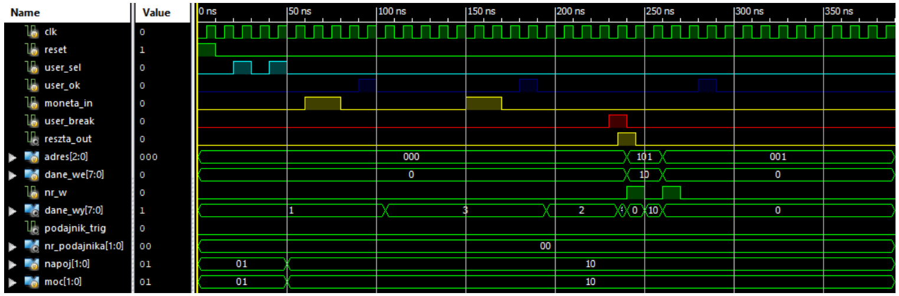

# Vending Machine Controller (VHDL & Verilog Mixed-Design)

## 🇬🇧 English Version

### Project Overview
This repository contains a digital controller for a **Vending Machine** (Coffee, Tea, Juice) designed for FPGA implementation. The project demonstrates a **Mixed-Language Design** approach, combining a behavioral VHDL core with a modern Verilog simulation environment.

### File Structure
* **`napoje_beh.vhd`**: The core logic (VHDL). It implements a Finite State Machine (FSM) and register-based memory mapping.
    * *Note: I performed logic modifications and optimizations on this existing source code.*
* **`napoje_beh_tb.v`**: The **Testbench (Verilog)**. This was developed **entirely by me** to verify the machine's behavior through various scenarios.

### Technical Features
* **FSM Architecture**: Manages states including `RESET`, `SELECTION`, `STRENGTH`, `PAYMENT`, `PREPARATION`, and `CHANGE/RETURN`.
* **Memory Mapping**: Addressable registers for drink prices and stock levels (accessible via the `adres` and `dane_we` ports).
* **Edge Detection**: Robust user input handling using internal edge finders for `OK`, `SELECT`, and `COIN` signals to prevent debouncing issues.
* **Dynamic Pricing**: Calculates total cost based on the selected drink type and strength multiplier.

### Verification (Testbench)
The Verilog Testbench (`napoje_beh_tb.v`) validates the following:
1. **Selection Flow**: Cycling through drink types and selecting "Strength" levels.
2. **Payment Logic**: Simulating coin insertion and verifying the balance against the calculated price.
3. **Operation Break**: Testing the system's reaction to the `user_break` signal.
4. **Hardware Triggers**: Monitoring the `podajnik_trig` pulses and dispenser ID.

### Simulation Results
Below is a screenshot of the ISim simulation waveform, demonstrating the successful selection of a drink, payment sequence, and dispenser trigger.

*Figure 1: Simulation trace showing FSM state transitions and output signals.*

---

## 🇵🇱 Wersja Polska

### O projekcie
Repozytorium zawiera sterownik cyfrowy **automatu do napojów** (kawa, herbata, sok) przygotowany do implementacji na układach FPGA. Projekt jest przykładem **projektowania wielojęzykowego (Mixed-Language)**, łączącego rdzeń w VHDL z nowoczesnym środowiskiem testowym w Verilogu.

### Struktura plików
* **`napoje_beh.vhd`**: Główna logika (VHDL). Implementuje automat skończony (FSM) oraz mapowanie pamięci oparte na rejestrach.
    * *Uwaga: W tym pliku przeprowadziłem modyfikacje logiki i optymalizację kodu źródłowego.*
* **`napoje_beh_tb.v`**: **Testbench (Verilog)**. Został napisany **w całości przeze mnie** w celu weryfikacji działania automatu w różnych scenariuszach.

### Funkcje techniczne
* **Architektura FSM**: Zarządza stanami takimi jak `RESET`, `WYBÓR`, `MOC`, `PŁATNOŚĆ`, `PRZYGOTOWANIE` oraz `RESZTA/ZWROT`.
* **Mapowanie pamięci**: Adresowalne rejestry dla cen napojów i stanów magazynowych (dostępne przez porty `adres` i `dane_we`).
* **Detekcja zboczy**: Stabilna obsługa wejść użytkownika dzięki wewnętrznym modułom "edge finder" dla sygnałów `OK`, `SELECT` i `COIN`.
* **Dynamiczne naliczanie**: Obliczanie należności na podstawie wybranego typu napoju oraz mnożnika mocy.

### Weryfikacja (Testbench)
Autorski testbench w Verilogu (`napoje_beh_tb.v`) sprawdza:
1. **Przepływ wyboru**: Przełączanie między napojami i wybór poziomu mocy.
2. **Logikę płatności**: Symulację wrzucania monet i weryfikację salda względem ceny.
3. **Przerwanie operacji**: Testowanie reakcji systemu na sygnał `user_break` (anulowanie).
4. **Sterowanie sprzętem**: Monitorowanie impulsów `podajnik_trig` oraz numeru podajnika.
